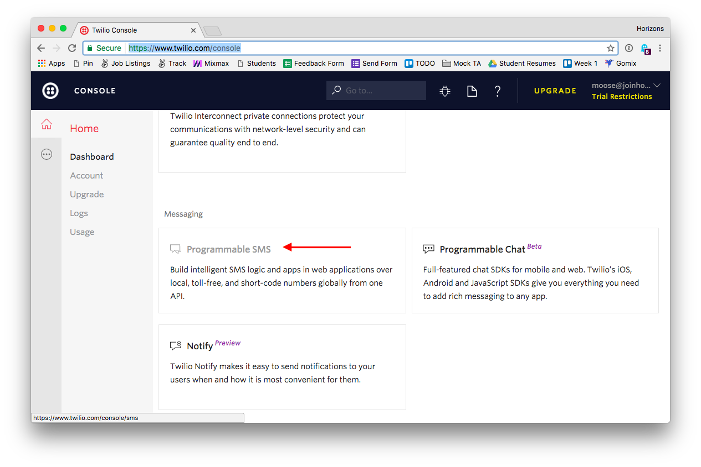
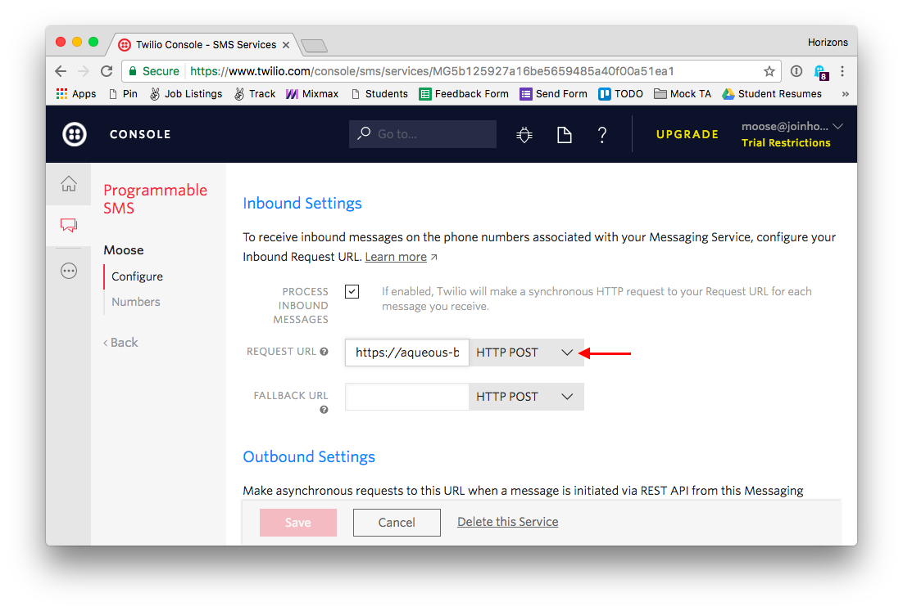
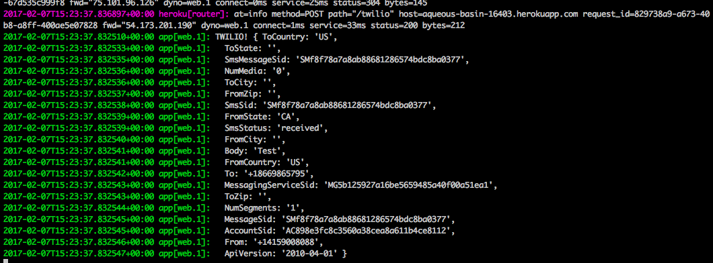

# Inline exercise: Twilio TwiML voicemail
## Time limit: 10 minutes

## Goal

You've already seen how to use Twilio to send outgoing SMS messages, as part of
the TwilioShoutout exercise. In this exercise, you're going to receive
text messages send your Twilio phone number.

Note: this exercise assumes you already created a free Twilio account, and
selected a phone number. Do that first if you haven't yet.

## Instructions

### `POST /twilio` endpoint

1. Open up your application from the previous 2 inline exercises.
1. Install `body-parser` with `npm install --save`
1. Create a new `POST /twilio` endpoint that does
  `console.log('Twilio!', req.body)` and `res.send('ok')`
1. Push your code to Heroku.
1. Watch your Heroku logs with `heroku logs --tail` and
  use Postman to make a `POST` request to the `/twilio` endpoint
  of your application. Note how your request showed up in the
  console.

### `POST /twilio` endpoint

1. Log into Twilio and open up `Programmable SMS` in your dashboard

  

1. Create a new messaging service, give it a name.
1. Open up the messaging service you've just created and click on
  `Numbers` on the left. Find the number you've created from before
  and add it to your messaging service.

  If you don't see any numbers, click `Buy a number` and pick a
  new number. Don't worry, the first number is free 💸.
1. Switch to `Configure` on the left, scroll down to `Inbound Settings`.
  Make sure `Process Inbound Messages` is checked and paste
  the URL of your Heroku app followed by `/twilio` to the
  request URL field. This is the URL that Twilio will send a `POST`
  to whenever it receives a text message.

  ```plain
  https://YOUR APP NAME.herokuapp.com/twilio
  ```

  

1. Make sure you're watching your application logs in your terminal
  with `heroku logs --tail` and then text your Twilio number
  from your phone, you should see a message in your logs!

  

1. Congrats, you've just implemented a webhook!
